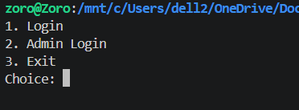
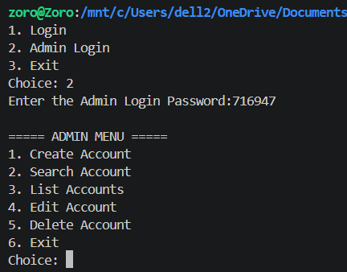
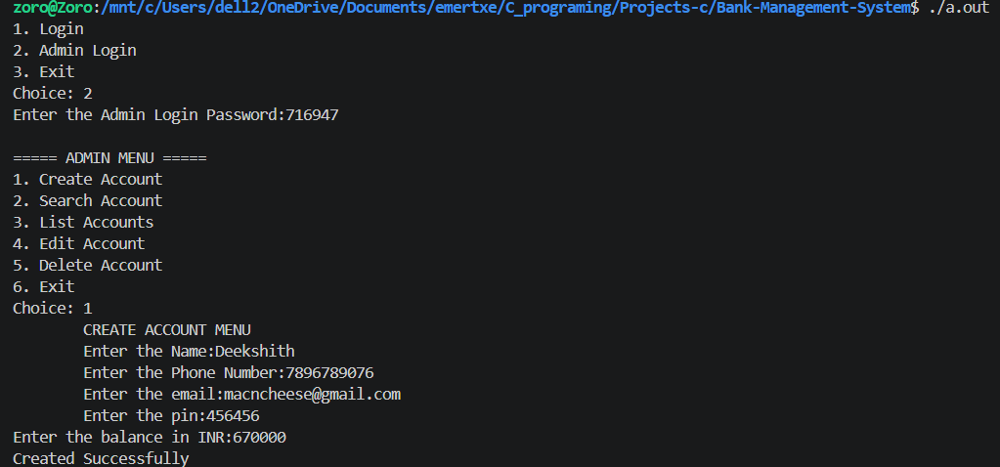
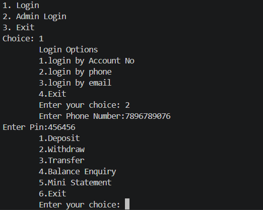
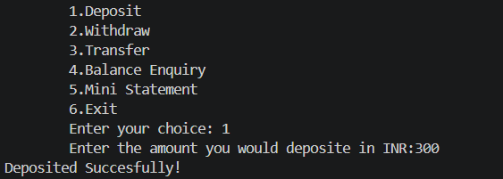
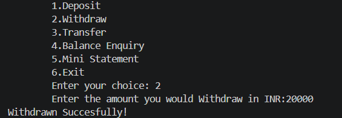
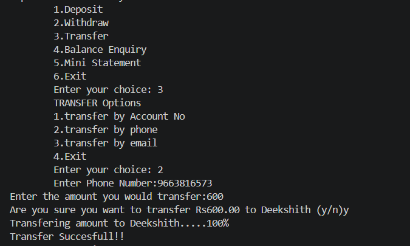
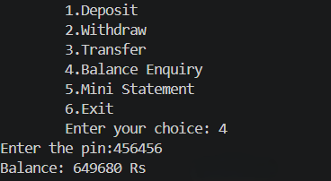
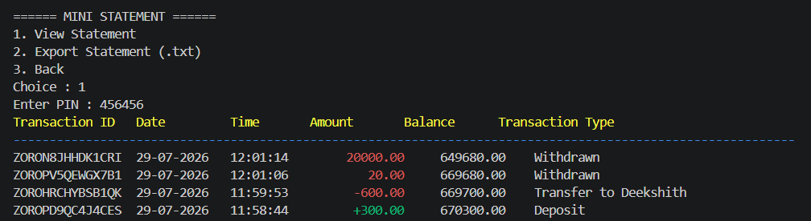
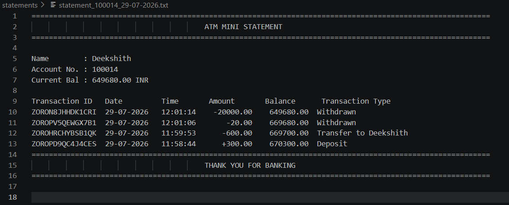

# Bank Management System

A **Bank Management System** developed in **C** that simulates essential banking operations through a secure, menu-driven console application. The application is built using modular programming and file handling, providing persistent storage for customer accounts and transaction records.

---

## Features

### Admin Module
- Create new customer accounts
- Search accounts
- Edit customer details
- Delete accounts
- View all registered accounts
- Automatic account number generation

### User Module
- Login using:
  - Account Number
  - Phone Number
  - Email
- Deposit funds
- Withdraw funds
- Transfer funds
- Balance enquiry
- View Mini Statement
- Export Mini Statement (.txt)

### Transaction Management
- Unique transaction ID generation
- Date & time stamped transactions
- Transaction history stored in CSV format
- Display the latest 10 transactions
- Export statements to text files

### Validation
- Name validation
- Phone number validation
- Email validation
- PIN validation
- Duplicate phone and email detection

### File Handling
- `accounts.csv` for account records
- `history.csv` for transaction history
- `statements/` for exported statements

---

## Technologies Used

- C
- File Handling
- Structures
- Modular Programming
- CSV Data Storage

---

## Project Structure

```text
Bank-Management-System/
│
├── images/
│
├── main.c
├── atm.c
├── transaction.c
├── validation.c
├── file.c
│
├── atm.h
├── transaction.h
├── validation.h
├── file.h
│
├── accounts.csv
├── history.csv
├── statements/
│
├── README.md
└── .gitignore
```

---

## Build

```bash
gcc main.c atm.c transaction.c validation.c file.c -o bank_management_system
```

## Run

```bash
./bank_management_system
```

---

# Screenshots

> Place all screenshots inside the `images/` folder. The README will automatically load them using the paths below. Rename the filenames if yours are different.

## Main Menu



## Admin Dashboard



## Create Account



## User Login



## Deposit



## Withdraw



## Transfer



## Balance Enquiry



## Mini Statement



## Exported Statement



---

## Future Improvements

- PIN change functionality
- Password encryption
- Account lock after multiple failed login attempts
- Database integration
- Graphical User Interface (GUI)

---

## Author

**Deekshith**

Electronics Engineering Student

If you found this project useful, consider giving it a ⭐ on GitHub.
